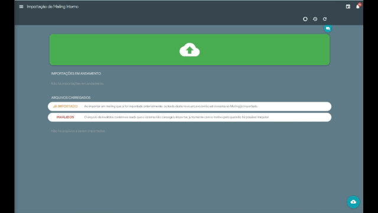
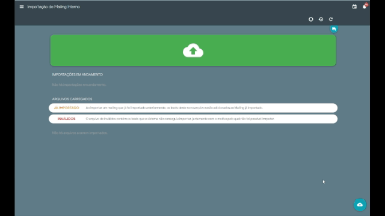
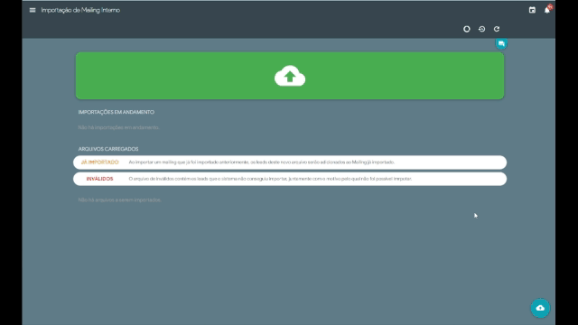
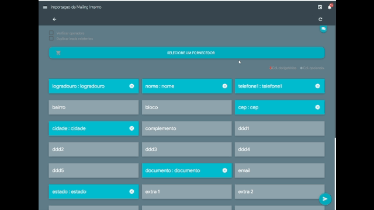

<<<<<<< HEAD

=======

 

>>>>>>> 3e3cf8b94114b2077b184ebbd8c484e76a5974d8

 

# IMPORTAÇÃO DE MAILING

<<<<<<< HEAD
---

 
 
 
 

 

# 1 - Podemos importar os arquivos para o sistema de *`três`* maneiras.

>## **1.1 - Primeira forma de importação** 
_Clicando no centro da caixa verde, abrirá uma opção de pesquisa de arquivo,
seleciona o mesmo e clica em_ `Abrir` _para começar a importação._

>## **1.2 - Segunda forma de importação** 
_Clica no ícone no canto inferior direito onde abrirá uma opção de pesquisa de arquivo, seleciona o mesmo e clica em_ `Abrir` _para começar a importação._

>## **1.3 - Terceira forma de importação**
_Arrasta o aquivo para o centro da caixa verde para começar a importação._

##### 1.3.1 -  Muito importante, o formato do arquivo tem que ser em [.csv](https://drive.google.com/file/d/1BHcN4QvCnNHDNB-jPDdUeCkT0hu0Ie7v/view?usp=sharing).

# 2 - Trabalhando o arquivo.

>## **2.1 - Clica no arquivo que foi importado**

>## **2.2 - Selecionando o fornecedor**

_Clique no botão escrito `SELECIONE UM FORNECEDOR`, para dar continuidade no processo._

##### 2.2.1 -  Para seguir o processo de importação é necessário selecionar um fornecedor.

 

>## **2.3 - Os campos obrigatórios da importação são:**

##### 2.3.1 -  Os obrigatórios se desmarcados ficam em vermelho, o resto em cinza se desmarcado.

##### 2.3.2 - Colocando os nomes corretamente as colunas serão preenchidas nos campos certos, deixaremos um [`ARQUIVO PADRÃO`](https://drive.google.com/file/d/14R_HsXNHtrN8R2Lk96DNvRI_71LZC0E1/view?usp=sharing) para efetuarem a higienização do `mailing`.

 

>## 2.4 - Terminando a seleção.

_só_ `Iniciar importação` _clicando no botão inferior direito._

 

>## **2.5 - Finalizando importação**

_O arquivo fica nesta parte `IMPORTAÇÕES EM ANDAMENTO` até a finalização da importação._

 
 
 #### 2.5.1 -  Tem a opção de carregar vários arquivos, mas o processo de importação é somente um por vez.

 

>## **2.6 - Arquivo inválidos**

 _Caso haja registros inválidos, o sistema irá montar um novo arquivo contendo com esses registros inválidos e no final de cada registro terá o motivo ao qual impediu que ele fosse importado._
_O arquivo terá o mesmo nome que você importou acrescentado a terminação INVÁLIDOS no final. ele aparecerá na área de arquivos_ `ARQUIVOS CARREGADOS` _porém, com a palavra_ `INVÁLIDOS` _do lado, podendo fazer o download do arquivo clicando na_ :arrow_down: _para possíveis correções, editar dentro do sistema mesmo, clicando na_ :pencil2:, _ou excluir os registros inválidos clicando na_ .

 

>## **2.7 - Notificações do fim do Processo de importação** 

_Clicando no_ :bell: _abrirá as notificações e poderá ver o que aconteceu com o arquivo que colocou para importar._

 

# 3 - Mailing Pronto!

**3.1 - Caminho para vizualizar o mailing**

 _Clicando no canto superior esquerdo no_  _abrirá os menus, clicando em_ :pencil: _*Mailings*_ _depois novamente em_  *Mailings*. _Veremos o arquivo importado._

=======
 
 
 
 

 

# 1 - Podemos importar os arquivos para o sistema de *`três`* maneiras.

>## **1.1 - Primeira forma de importação** 
_Clicando no centro da caixa verde, abrirá uma opção de pesquisa de arquivo,
seleciona o mesmo e clica em_ `Abrir` _para começar a importação._

>## **1.2 - Segunda forma de importação** 
_Clica no ícone no canto inferior direito onde abrirá uma opção de pesquisa de arquivo, seleciona o mesmo e clica em_ `Abrir` _para começar a importação._

>## **1.3 - Terceira forma de importação**
_Arrasta o aquivo para o centro da caixa verde para começar a importação._

##### 1.3.1 -  Muito importante, o formato do arquivo tem que ser em [.csv](https://drive.google.com/file/d/1BHcN4QvCnNHDNB-jPDdUeCkT0hu0Ie7v/view?usp=sharing).

# 2 - Trabalhando o arquivo.

>## **2.1 - Clica no arquivo que foi importado**

>## **2.2 - Selecionando o fornecedor**

_Clique no botão escrito `SELECIONE UM FORNECEDOR`, para dar continuidade no processo._

##### 2.2.1 -  Para seguir o processo de importação é necessário selecionar um fornecedor.

 

>## **2.3 - Os campos obrigatórios da importação são:**

##### 2.3.1 -  Os obrigatórios se desmarcados ficam em vermelho, o resto em cinza se desmarcado.

##### 2.3.2 - Colocando os nomes corretamente as colunas serão preenchidas nos campos certos, deixaremos um [`ARQUIVO PADRÃO`](https://drive.google.com/file/d/14R_HsXNHtrN8R2Lk96DNvRI_71LZC0E1/view?usp=sharing) para efetuarem a higienização do `mailing`.

 

>## 2.4 - Terminando a seleção.

_só_ `Iniciar importação` _clicando no botão inferior direito._

 

>## **2.5 - Finalizando importação**

_O arquivo fica nesta parte `IMPORTAÇÕES EM ANDAMENTO` até a finalização da importação._

 
 
 #### 2.5.1 -  Tem a opção de carregar vários arquivos, mas o processo de importação é somente um por vez.

 

>## **2.6 - Arquivo inválidos**

 _Caso haja registros inválidos, o sistema irá montar um novo arquivo contendo com esses registros inválidos e no final de cada registro terá o motivo ao qual impediu que ele fosse importado._
_O arquivo terá o mesmo nome que você importou acrescentado a terminação INVÁLIDOS no final. ele aparecerá na área de arquivos_ `ARQUIVOS CARREGADOS` _porém, com a palavra_ `INVÁLIDOS` _do lado, podendo fazer o download do arquivo clicando na_ :arrow_down: _para possíveis correções, editar dentro do sistema mesmo, clicando na_ :pencil2:, _ou excluir os registros inválidos clicando na_ .

 

>## **2.7 - Notificações do fim do Processo de importação** 

_Clicando no_ :bell: _abrirá as notificações e poderá ver o que aconteceu com o arquivo que colocou para importar._

 

# 3 - Mailing Pronto!

**3.1 - Caminho para vizualizar o mailing**

 _Clicando no canto superior esquerdo no_  _abrirá os menus, clicando em_ :pencil: _*Mailings*_ _depois novamente em_  *Mailings*. _Veremos o arquivo importado._

>>>>>>> 3e3cf8b94114b2077b184ebbd8c484e76a5974d8

